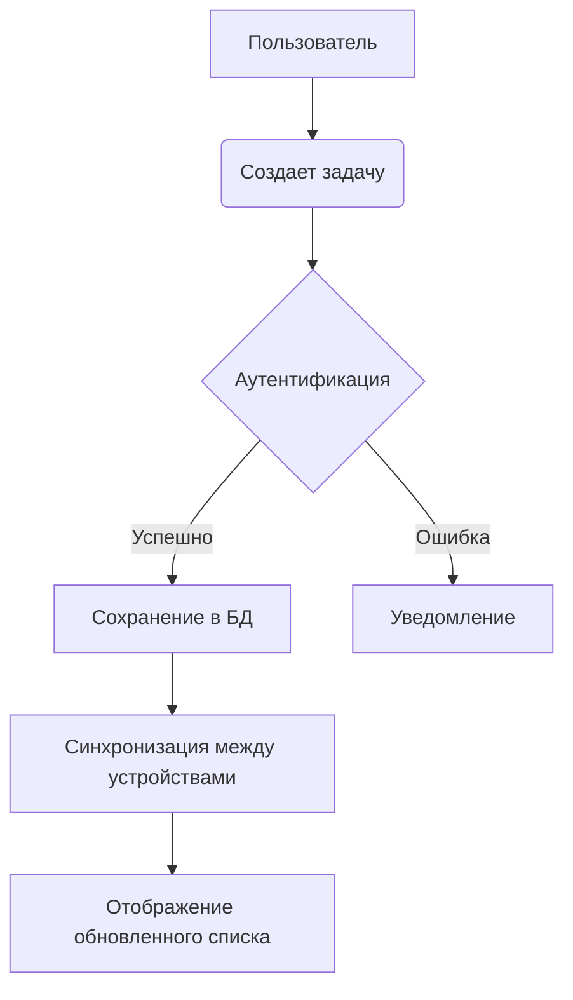

# Контекст продукта: Todo List Application

*Последнее обновление: 2023-01-10*

## Зачем существует этот проект
Проект создан для предоставления пользователям простого и эффективного инструмента управления задачами с:
- Минимальной кривой обучения
- Высокой производительностью
- Кросс-платформенной доступностью
- Защитой конфиденциальных данных

## Решаемые проблемы
1. **Фрагментация задач** - Централизованное хранение всех задач в одном месте
2. **Потеря фокуса** - Четкая визуализация приоритетов и сроков
3. **Сложность синхронизации** - Автоматическая синхронизация между устройствами
4. **Избыточность функций** - Минималистичный интерфейс без ненужных элементов

## Принцип работы

## Цели пользовательского опыта
- **Простота**: Добавление задачи за ≤2 клика
- **Скорость**: Загрузка интерфейса <1s на любом устройстве
- **Надежность**: Доступность 99.9% времени
- **Персонализация**: Настройка категорий и тегов
