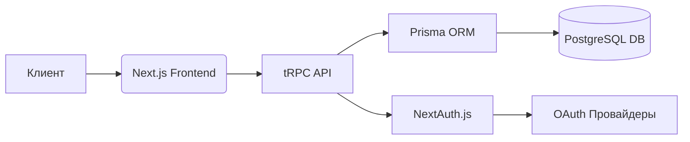

# Архитектурные паттерны и решения

*Последнее обновление: 2023-01-10*

## Системная архитектура

## Ключевые технические решения
1. **End-to-end Type Safety**: Использование tRPC для типобезопасного взаимодействия клиент-сервер
2. **Isomorphic Architecture**: Единая кодовая база для клиента и сервера
3. **Optimistic UI**: Реализация мгновенных интерфейсных изменений через React Query
4. **Stateless Auth**: Безсерверная аутентификация через JWT

## Паттерны проектирования
- **Repository Pattern**: Prisma как слой абстракции для работы с БД
- **Observer Pattern**: Реактивные обновления через React Query
- **Factory Pattern**: Генерация форм через Zod-схемы
- **Decorator Pattern**: Расширение базовой функциональности tRPC middleware
