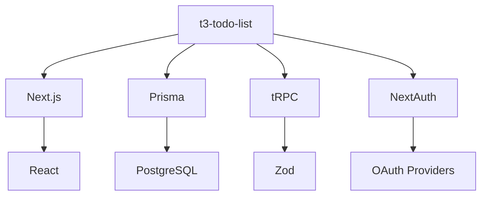

# Технический контекст

*Последнее обновление: 2023-01-10*

## Технологический стек
| Категория       | Технологии                          |
|-----------------|-------------------------------------|
| Frontend        | Next.js 15, React 19, Tailwind CSS  |
| Backend         | tRPC, Next.js API Routes            |
| Database        | PostgreSQL, Prisma ORM              |
| Auth            | NextAuth.js                         |
| State Management| React Query                         |
| Validation      | Zod                                 |
| Tooling         | ESLint, Prettier, TypeScript 5.8    |

## Настройка разработки
```bash
# Клонирование репозитория
git clone https://github.com/your-repo/t3-todo-list.git
cd t3-todo-list

# Установка зависимостей
bun install

# Настройка БД (требует .env с DATABASE_URL)
bun run db:migrate
bun run db:generate

bun run dev        # Запуск dev-сервера
bun run build      # Сборка production-версии
bun run db:generate # Генерация Prisma-клиента
bun run lint       # Проверка кода
```


## Технические ограничения
1. **Среда выполнения**: Требуется Node.js ≥20
2. **Браузерная поддержка**: Chrome, Firefox, Safari последних 2 версий
3. **Размер БД**: PostgreSQL с ограничением 10GB на начальном этапе
4. **Файловая система**: Vercel Serverless Functions (макс. 10MB payload)

## Ключевые зависимости

