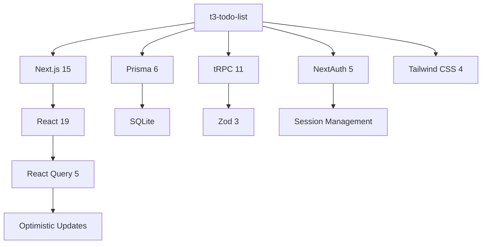

# Технический контекст

*Последнее обновление: 2025-01-11*

## Технологический стек

### Frontend
| Технология | Версия | Назначение |
|---|---|---|
| **Next.js** | 15.2.3 | React фреймворк с серверным рендерингом |
| **React** | 19.0.0 | UI библиотека |
| **React Query** | 5.69.0 | Управление состоянием асинхронных данных и кеширование |
| **Tailwind CSS** | 4.0.15 | Утилитарное CSS фреймворк для стилизации |
| **react-hot-toast** | 2.6.0 | Система уведомлений и toast сообщений |
| **tRPC** | 11.0.0 | End-to-end типобезопасный RPC фреймворк |
| **Next.js API Routes** | 15.2.3 | Серверные эндпоинты |
| **Prisma** | 6.6.0 | ORM для работы с базой данных |
| **NextAuth.js** | 5.0.0-beta.25 | Решение для аутентификации пользователей |
| **@auth/prisma-adapter** | latest | Адаптер для интеграции Prisma с NextAuth.js |
| **Zod** | 3.24.2 | TypeScript-first валидация схем данных |
| **zod-prisma-types** | 3.2.4 | Генерация Zod типов из Prisma схемы |
| **TypeScript** | 5.8.2 | Статическая типизация языка |
| **ESLint** | 9.23.0 | Статический анализ и выявление ошибок в коде |
| **Prettier** | 3.5.3 | Форматирование кода |

## База данных
- **СУБД**: SQLite (prisma/db.sqlite)
- **Подход**: Схемодефированный через Prisma
- **ORM**: Prisma для безопасного взаимодействия с БД

## Философия разработки

Проект следует принципам:
- **Типобезопасность** - использование TypeScript и tRPC для максимальной безопасности типов
- **Производительность** - оптимистичные обновления и кеширование на клиенте
- **Простота** - минимальный набор features, фокус на качестве реализации
- **Масштабируемость** - архитектура позволяет легко добавлять новый функционал
- **Безопасность** - аутентификация, валидация данных, изоляция данных пользователей

## Ключевые архитектурные решения

### 1. End-to-end Type Safety
- **tRPC** обеспечивает полную типизацию между клиентом и сервером
- **Zod** используется для валидации на клиенте и сервере
- **TypeScript** гарантирует статическую типизацию во время разработки

### 2. Оптимистичные обновления
- React Query используется для оптимистичных обновлений UI
- При мутации интерфейс обновляется немедленно
- Если операция на сервере неудачна - данные восстанавливаются автоматически
- Показываются toast уведомления об ошибках

### 3. Разделение ответственности
```
Frontend (React компоненты)
        ↓
    tRPC Layer
        ↓
Backend (Роутеры)
        ↓
Prisma ORM
        ↓
SQLite DB
```

## Структура проекта

```
src/
├── app/
│   ├── _components/        # React компоненты
│   │   ├── TodoList.tsx    # Список задач
│   │   └── CreateTodo.tsx  # Форма создания
│   ├── api/auth/           # NextAuth эндпоинты
│   ├── layout.tsx          # Главный layout
│   └── page.tsx            # Главная страница
├── server/
│   ├── api/
│   │   ├── routers/
│   │   │   └── todo.ts     # tRPC маршруты для задач
│   │   ├── root.ts         # Главный роутер
│   │   └── trpc.ts         # tRPC конфигурация
│   ├── auth.ts             # NextAuth конфигурация
│   └── db.ts               # Подключение к БД
├── trpc/
│   ├── server.ts           # Серверный tRPC клиент
│   └── react.ts            # Клиентский React Query интеграция
├── schemas/
│   └── todo.ts             # Zod схемы валидации
└── env.js                  # Переменные окружения
```

## Настройка разработки

```bash
# Клонирование репозитория
git clone https://github.com/your-repo/t3-todo-list.git
cd t3-todo-list

# Установка зависимостей
bun install

# Настройка БД
bun run db:migrate
bun run db:generate

# Запуск dev-сервера
bun run dev

# Другие команды
bun run build      # Сборка production-версии
bun run lint       # Проверка кода ESLint
bun run format     # Форматирование с Prettier
```

## Технические требования

### Среда выполнения
- **Node.js**: ≥20
- **Package Manager**: bun / npm / yarn / pnpm
- **Browser Support**: Chrome, Firefox, Safari последних 2 версий

## Производительность & Оптимизация

### Клиент
- React Query кеширование снижает количество запросов к серверу
- Оптимистичные обновления улучшают ощущение отзывчивости
- Tailwind CSS минимизируется для production

### Сервер
- tRPC обеспечивает минимальный overhead сравнению с REST
- Prisma оптимизирует запросы к БД
- Next.js API Routes масштабируются как serverless функции

## Инструменты для разработки

### Code Quality
- **ESLint 9.23.0** - статический анализ с правилами Next.js
- **Prettier 3.5.3** - автоматическое форматирование кода
- **TypeScript 5.8.2** - строгая типизация

### Database
- **Prisma Studio** - визуальный редактор БД (bun run prisma studio)
- **Prisma Migrate** - управление миграциями

## Ключевые зависимости и их взаимодействие


